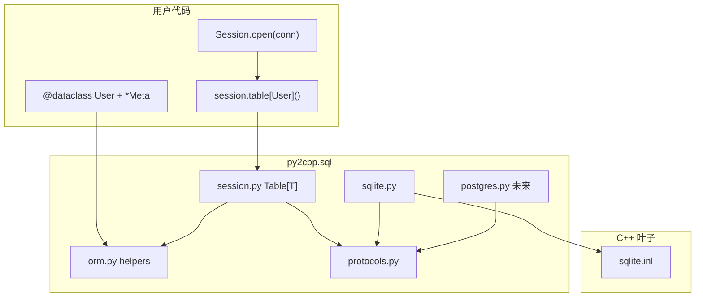

# SQL / ORM：DB-API + 静态反射表映射规范

> **状态**：**P0 DB-API 已落地**（`protocols.py` + `sqlite.py` + `templates/sql/+sqlite.inl` + `test/sql/test_sqlite.py`）；**ORM P1+ 设计中**（尚无 `orm.py` / `session.py`）。  
> **约束**：符合 [编码规范.md](./编码规范.md)；**不新增** `@table` 等装饰器或译器 pass；ORM 仅复用既有 `@annotation` *Meta、`@dataclass`、`Self.iter_fields` / `Self.get_field_annotation[Meta](field)`（与 `ui/panel` 同构）；Native 原子化（业务零 `@native`，C++ 仅叶子）；不引入 STL；**暂不支持** SQLAlchemy 级 Query DSL / relationship / migration 框架。

---

## 1. 目标

在 Py2Cpp 中提供 **关系型数据库访问**，满足：

1. **DB-API 子集**：对齐 CPython 3.13 `sqlite3` 常用用法（`connect` / `execute` / `fetch*` / `commit`），供手写 SQL。
2. **ORM Declarative**：``Session.table[Entity]()`` 得 ``Table[Entity]`` 句柄（**禁止**把实体类名作普通实参）；表级 ``append`` / ``get`` / ``all`` / ``create_schema``（P2 批量插 ``extend``）；事务级 ``commit`` / ``rollback`` 仍在 ``Session``。
3. **译期静态反射**：ORM 列映射由 **`@annotation` *Meta** + `Self.iter_fields` 在 **`session.py` / `orm.py` 标准库内**编译期展开，**零运行时反射**（与 `UIPanelMixin` 同模式）。
4. **可插拔后端**：协议层与 SQLite 实现分离；未来可增 PostgreSQL 等后端而不改用户 ORM 类。
5. **Pythonic 增查改删**：P1 **单行插** ``users.append(entity)``；P2+ **批量插** ``extend``、**读/删/改** ``collect``/``remove``/``execute(e.assign…)``（genexp → 内联 **`SqlQuery[T]`**；``assign`` 写入 ``set_sql``/``set_binds``）；P3 **联表读** ``session.collect[RowT](Row(…) for x in a for y in b if x.u == y.v)``（``SqlQuery[RowT]``；**方法须** ``collect[T]``）；**禁止** ``filter(eq)`` / ``touch`` / ``users.iter()`` / ``add`` / ``Join`` 工厂 / ``relationship``。

与 `py2cpp.serde` 的关系：

| 域 | 模块 | 职责 |
|----|------|------|
| 序列化格式 | `py2cpp/serde/` | JSON、base64 等 **wire 格式** |
| 关系型持久化 | `py2cpp/sql/` | DB-API + ORM **表落盘** |

二者可叠加（P2）：同一 `@dataclass` 同时 `@serializable` 与 ORM 字段注解；P1 仅保证互不干扰。**ORM 不要求**也不提供类似 `@table` 的额外装饰器。

---

## 2. 目录与命名空间

```text
py2cpp/sql/
  __init__.py          # 薄包根
  protocols.py         # @protocol：Connection / Cursor / Dialect / SqlQuery[T]
  orm.py               # @annotation *Meta、ORM 静态 helper
  session.py           # Session + Table[T]
  sqlite.py            # SQLite 实现 + connect() + 异常
  # 未来：postgres.py、mysql.py

third_party/sqlite/      # SQLite amalgamation（已 vendoring，见 README.md）
  sqlite3.c
  sqlite3.h
  sqlite3ext.h

templates/               # 模板根：镜像 generated/runtime/py2cpp/**（见 codegen-templates.md §8）
  ~helpers.inl           # 跨模块；sql/sqlite.inl 内 PY2CPP_INCLUDE("../~helpers.inl")
  sql/sqlite.inl         # → generated/runtime/py2cpp/sql/sqlite.inl
  sql/~bind.inl          # 同目录 INCLUDE：~bind.inl

src/codegen/
  templates/sql/+sqlite.inl        # C 叶子（paste / inject；已迁出旧 *_cpp.py）
  expand_py2cpp_template.py
  # 未来：postgres_cpp.py 等

test/sql/
  test_sqlite.py       # DB-API
  test_sql_orm.py      # Session + @dataclass 表映射
```

C++ 命名空间（建议）：

```text
py2cpp::sql::sqlite::Connection
py2cpp::sql::Session
py2cpp::sql::Table<User>              # 模板表句柄
py2cpp::sql::protocols::Dialect       # 协议 traits，无类体
```

---

## 3. 架构分层

```text
用户 @dataclass + 字段/类 @annotation *Meta
        ↓
Session.table[Entity]() → Table[Entity]（ORM 入口；Self = Entity）
        ↓
Connection + Dialect（protocols.py 契约；sqlite.py 首实现）
        ↓
@native 叶子（templates/sql/+sqlite.inl → sqlite.inl → third_party/sqlite/sqlite3.c）
```



| 层 | 模块 | 职责 |
|----|------|------|
| **协议** | `protocols.py` | `Connection`、`Cursor`、`Dialect`、**`SqlQuery[T]`**（genexp 译期产物类型） |
| **ORM 元数据** | `orm.py` | `TableMeta`、`PrimaryKeyMeta`、`ColumnMeta`、`IgnoreMeta`；`table_name` / `create_schema_sql` 等 **静态 helper**（内部 `Self.iter_fields`） |
| **Session** | `session.py` | …；P3 ``collect[T](query: SqlQuery[T])`` 联表 |
| **Table[T]** | `session.py` | ``create_schema``/``append``/``get``/``all``；P2 ``extend``/``collect``/``remove``/``execute``（``SqlQuery[T]`` + genexp） |
| **后端** | `sqlite.py` | `connect()`、`SqliteConnection`、`SqliteDialect`、异常树 |
| **Native** | `templates/sql/+sqlite.inl` | 仅 `@native` 叶子（open/prepare/step/bind/column/…） |

**扩展新数据库**：实现 `XxxConnection` + `XxxDialect` 满足 `protocols.py`；`orm.py` / 用户 `@dataclass` 表类 / `Session` API **不变**。

**译器**：**不新增** pass、`builtins` 桩或语法。ORM 逻辑全部写在 `py2cpp/sql/` 标准库 Python 中，依赖已有 `expand_iter_fields_meta`（与 Panel 相同）。

---

## 4. 目标写法

### 4.1 ORM 表类（Declarative，无新装饰器）

```python
from py2cpp import *
from py2cpp.sql.orm import TableMeta, PrimaryKeyMeta, ColumnMeta, IgnoreMeta
from py2cpp.sql.session import Session, Table
from py2cpp.sql.sqlite import connect
from py2cpp.core.optional import Optional

@TableMeta("users")
@copyable
@dataclass
class User:
  id: int @PrimaryKeyMeta = 0
  name: str @ColumnMeta("display_name") = ""
  nickname: Optional[str] = None       # 可空 → SQL NULL
  active: bool = True
  _cache: int @IgnoreMeta = 0          # 不参与持久化
```

约定：

- **表实体**：`@copyable` `@dataclass`，且至少一个公有字段标 **`@PrimaryKeyMeta`**；经 **`session.table[Entity]()`** 绑定为 ``Table[Entity]``（无 PK 则 ``create_schema`` / ``append`` 报错）。
- **可空**：字段类型为 **`Optional[T]`** 即允许 SQL `NULL`；DDL 不加 `NOT NULL`；bind/read 走 Optional 分支。**不在** `ColumnMeta` 上设 `nullable`。
- **忽略**：**`@IgnoreMeta`** 字段不参与 DDL / INSERT / SELECT / UPDATE 列集。
- **表名**：类装饰 **`@TableMeta("users")`**（现有 `@annotation` 机制，**不是**新内置装饰器）；缺省时由类名推导（见 §6.3）。
- **列名**：`@ColumnMeta("col")` 覆盖；缺省用 Python 字段名。

### 4.2 Session 与 `Table[T]`（类型下标，非类名实参）

对齐 [serde-document-crud.md](./serde-document-crud.md) **谁泛型谁传参**（``JsonDocument[T].open``；**禁止** ``JsonDocument.open[T](…)``）：

| ✅ 写法 | ❌ 禁止 |
|--------|--------|
| ``session.table[User]()`` | ``session.all(User)``、``session.get(User, pk)`` |
| ``users: Table[User] = session.table[User]()`` | 把 ``User`` 当作普通 positional 参数 |

```python
session: Session = Session.open(connect(":memory:"))
users: Table[User] = session.table[User]()
users.create_schema()

u: User = new()
u.name = "alice"
users.append(u)
session.commit()                       # id==0 时写回 last_insert_rowid

got: Optional[User] = users.get(u.id)
rows: list[User] = users.all()
session.rollback()
session.close()
```

- **``Session.table[T]()``**：PEP 695 泛型工厂；``T`` 为 ``@dataclass`` 实体类；返回 ``Table[T]`` 句柄（可缓存：``users = session.table[User]()``）。
- **``Table[T]``** 内 ORM 调用 ``orm.py`` 静态 helper，以 **``Self = T``** 做 ``Self.iter_fields`` 译期展开；**不再**向方法传入实体类名。
- **事务**：``commit`` / ``rollback`` / ``close`` 在 **``Session``**；DML 在 **``Table[T]``** 上，共用同一 ``Connection``。

**命名**：``Table`` 方法**勿**用 ``select``（与译期 ``obj.select("…")`` 路径 DSL 及 [编码规范 S33](./编码规范.md) 区分）；全表物化用 **`all()``**；懒遍历用 **`for u in users`**（P2，**无** ``users.iter()`` 公开方法）。

**``Table[T]`` 方法（P1 / P2）**：

| 方法 / 协议 | 返回 | 说明 |
|------|------|------|
| ``create_schema()`` | ``void`` | DDL ``CREATE TABLE IF NOT EXISTS …`` |
| ``append(entity)`` | ``void`` | 单行 INSERT；PK==0 时 commit 前写回 |
| ``get(pk)`` | ``Optional[T]`` | 按 PK SELECT 单行 |
| ``all()`` | ``list[T]`` | 全表物化 |
| ``Iterable[T]``（``for u in users``） | 懒序列 | P2；底层 ``SELECT *`` 游标逐行 ``row_to_entity`` |
| ``extend(query)`` / ``collect(query)`` / ``remove(query)`` / ``execute(query)`` | 见 §4.3 | P2；``query: SqlQuery[T]`` + genexp |

### 4.3 增查改删与 genexp（P2+，Pythonic）

用户写法：**插/读/删** genexp 元素为实体 ``e``；**改** genexp 元素为 **`e.assign(字段=表达式, …)`**（复用 [编码规范 §7.4 ``assign``](./编码规范.md#74-kwargsoptions关键字选项) 译期字段赋值，**无** C++ ``assign`` 成员）。形参统一 **`SqlQuery[T]`**（**非** ``Iterable[T]``）。**单行插**仍用 §4.2 的 ``append(entity)``，**不用** genexp。

**数据源**：``Table[T]`` 实现 **`Iterable[T]`**（``for u in users``）；**禁止** ``users.iter()``。

**``Table[T]`` 增查改删（genexp 路径）**（形参 ``query: SqlQuery[T]``；参考实现体供译器分析 / 回退）：

```python
from py2cpp.sql.protocols import SqlQuery

@dataclass
class Table[T]:
  @immutable
  def extend(self, query: SqlQuery[T]) -> None:
    for e in query:
      self._insert(e)

  @immutable
  def collect(self, query: SqlQuery[T]) -> list[T]:
    out: list[T] = []
    for e in query:
      out.append(e)
    return out

  @immutable
  def remove(self, query: SqlQuery[T]) -> None:
    for e in query:
      self._delete_by_pk(e)

  @immutable
  def execute(self, query: SqlQuery[T]) -> None:
    for e in query:
      pass   # 可译：query 内嵌 set_sql；Phase B 拼 UPDATE；回退时再物化+写回
```

| 方法 | genexp 元素 | ``if`` 子句 | 语义 |
|------|-------------|-------------|------|
| ``extend`` | ``e``（待插实体） | 可选 | 批量 ``INSERT``（可 ``executemany``）；**非** ``u for u in users`` 自表遍历 |
| ``collect`` | ``e`` | 可选 | ``SELECT … WHERE …`` → ``list[T]`` |
| ``remove`` | ``e`` | 可选 | ``DELETE … WHERE …`` |
| ``execute`` | **`e.assign(kw=…)`** | 可选 | ``UPDATE … SET … WHERE …``（**一行**条件更新） |

**命名**：``Table.execute`` 为 ORM 条件写；与 ``Connection.execute(sql, params)``（DB-API 原始 SQL）**不同接收者、不同形参**，无歧义。

#### 示例：员工表 Alice 工资 +100（一行）

```python
@TableMeta("employee")
@copyable
@dataclass
class Employee:
  id: int @PrimaryKeyMeta = 0
  name: str = ""
  salary: int = 0

session: Session = Session.open(connect("app.db"))
employees: Table[Employee] = session.table[Employee]()

employees.execute(
  e.assign(salary=e.salary + 100) for e in employees if e.name == "Alice"
)
session.commit()
```

P2+ 可译时 lowering 为（示意）：

```sql
UPDATE employee SET salary = salary + 100 WHERE name = ?
-- bind: "Alice"
```

``e.assign(salary=e.salary + 100)`` 中 RHS 引用 **同行** ``e.salary`` → SQL ``SET salary = salary + 100``；``if e.name == "Alice"`` → ``WHERE``。外层局部变量同理绑定 ``?``。

#### 其它 P2 用法

```python
users: Table[User] = session.table[User]()
threshold: int = 10

staging: list[User] = [...]            # 内存中已构造的待插实体
users.extend(u for u in staging if u.active)

active: list[User] = users.collect(
  u for u in users if u.active and u.score > threshold
)
users.remove(u for u in users if not u.active)
session.commit()
```

单行插入仍用 ``append``（§4.2）；**不提供** ``add`` 别名。

**禁止** P2 改字段用 ``collect`` + ``for`` + ``touch`` 三步（``touch`` **不提供**）；须 ``execute(e.assign(…) for …)``。

#### 4.3.1 ``SqlQuery[T]``（译期产物，待格式化的具体类型）

**``SqlQuery[T]`` 本身即是 genexp 的编译产物**——带占位符的 SQL 片段 + 绑定槽 + 与 **`T`** 绑定的行形态；**不是**空 protocol 标记，也**不**另造 ``OrmSqlPlan`` 等并列类型。用户**只写 genexp**，译器在调用点 desugar 为 ``SqlQuery[T]`` 内联值（无堆分配）。

定义于 **`py2cpp/sql/protocols.py`**（``@protocol`` 供形参标注；字段由 ``orm_sql_query_emit`` 在调用点填充）：

```python
@protocol
class SqlQuery[T]:
  """genexp → 内联 ``SqlQuery[T]``；``T``=实体或投影行类型。用户勿手写 ``SqlQuery(...)``。"""
  def __iter__(self) -> Iterator[T]: ...   # 仅 ``compilable=False`` 回退路径
```

**``T`` 的含义**（与 ``list[T]`` 返回、格式化列集一致）：

| ``T`` | genexp 形态 | 消费方法 |
|-------|-------------|----------|
| 表实体 ``User`` | ``u for u in users if …`` / ``u.assign(…) for …`` | ``Table[User].collect/remove/execute/extend`` |
| 投影 ``OrderUserRow`` | ``Row(…) for o in … for u in … if …`` | ``Session.collect[OrderUserRow](…)`` |

**内联字段**（概念布局；C++ 侧为调用点字面量 / 小型 struct）：

| 字段 | 内容 |
|------|------|
| ``from_sql`` | ``FROM {table} AS {alias}``；多表时为 ``JOIN … ON …`` 链（§4.4） |
| ``where_sql`` | ``WHERE …``（字面量/外层局部 → ``?``） |
| ``binds`` | 与 ``where_sql`` 中 ``?`` **从左到右** 一致的绑定表达式 |
| ``set_sql`` | **``execute`` 专用**：由 genexp 元素 ``e.assign(kw=…)`` 在 Phase A 展开（如 ``salary = salary + ?``）；与 [§7.4 ``assign``](./编码规范.md#74-kwargsoptions关键字选项) 同源；非 assign genexp 为空 |
| ``set_binds`` | ``set_sql`` 中 ``?`` 的绑定（可与 ``binds`` 合并为单序列，实现期定） |
| ``select_sql`` | 投影列片段：实体 ``T`` 时由 ``Self.iter_fields`` 推导；联表时由 ``Row(…)`` 构造式展开 |
| ``compilable`` | 可下推 SQL 时为 ``true``；否则走 ``for … in query`` 回退 |
| ``generators`` | 别名 → ``Table[Entity]``（单表 / 多表） |

**单一译器入口**：``SqlQuery[…]`` 形参 + ``GeneratorExp`` 实参 → **`orm_sql_query_emit``** → 内联 **`SqlQuery[T]``**（**一条**路径；**不** per-method emit）。

**运行时**：无 ``SqlQuery`` 堆对象；可译时 Phase B 读内联字段拼最终 SQL 并 ``Connection.execute``。

| genexp 元素 | ``set_sql`` / ``select_sql`` | 方法 |
|-------------|------------------------------|------|
| 实体 ``e`` | ``select_sql`` ← ``T`` 列集 | ``collect`` / ``remove`` / ``extend`` |
| **`e.assign(…)`** | **`set_sql`` + ``set_binds`` 内嵌** | **仅** ``execute`` |
| 投影 ``Row(…)`` | ``select_sql`` ← ``Row`` 字段 | **仅** ``Session.collect[T]`` |

#### 4.3.2 genexp → ``SqlQuery[T]`` → 各方法格式化

**Phase A — 译器**：``orm_sql_query_emit(genexp, T) → SqlQuery[T]``（内联）

```text
(u for u in users if pred)
  → SqlQuery[User]{ from_sql, where_sql, binds, select_sql←User, compilable }

(e.assign(salary=e.salary+100) for e in employees if pred)
  → SqlQuery[Employee]{ from_sql, where_sql, binds,
                        set_sql="salary = salary + ?", set_binds=[100 表达式], … }

(Row(…) for o in orders for u in users if o.user_id==u.id and pred)   # P3
  → SqlQuery[OrderUserRow]{ from_sql+JOIN, where_sql, binds, select_sql←Row(…), … }
```

**Phase B — 标准库**（``session.py`` / ``Table[T]``；读 ``query`` 字段拼语句，**无二次 emit**）：

| 方法 | 格式化（读 ``SqlQuery[T]``） | 后续 |
|------|------------------------------|------|
| ``collect`` | ``SELECT {select_sql} {from_sql} {where_sql}`` | ``row_to_entity[T]`` / ``row_to_dataclass[T]`` |
| ``remove`` | ``DELETE {from_sql} {where_sql}`` | ``execute`` |
| ``execute`` | ``UPDATE {table} SET {set_sql} {where_sql}`` | 绑定 ``set_binds`` + ``binds`` |
| ``extend`` | ``INSERT INTO …`` + 源过滤 | ``executemany`` 等 |
| ``Session.collect[T]`` | 同 ``collect``（``T`` 为投影行；**方法** 泛型） | ``row_to_dataclass[T]`` |

示例（``collect``）：

```sql
SELECT u.id, u.display_name, … FROM users AS u WHERE u.active = ? AND u.score > ?
```

示例（``execute``；``set_sql`` 已内嵌在 ``SqlQuery``）：

```sql
UPDATE employee SET salary = salary + ? WHERE name = ?
```

**可下推**谓词 / SET 表达式子集：与 [selector.md §4.4](./selector.md#44-过滤步-exprpy2cpp-表达式) 同类。

**失败策略**：``query.compilable == false`` → 各方法走 ``for e in query`` 参考实现体；**禁止**为编译通过改用户写法。

约定：

- **条件**在 genexp ``if``；**赋值**在 ``e.assign`` → Phase A 写入 ``set_sql`` / ``set_binds``；**不**引入 ``Filter`` / ``eq`` DSL。
- **不提供** ``touch`` / ``add``；单行插 ``append``，批量插 ``extend``。
- **禁止** per-method 译器 emit；扩展 DML 须增 ``SqlQuery`` 字段或 Phase B 格式化规则。

### 4.4 联表（JOIN，P3）

多表读**不用** ``Join`` 工厂、``relationship`` 或 Query DSL；统一 **嵌套 genexp**：

```python
for x in table_a for y in table_b if x.u == y.v
```

入口在 **`Session.collect[T](query: SqlQuery[T]) -> list[T]`**（**方法须声明 PEP 695 泛型 ``[T]``**，与 ``session.table[Entity]()`` 同属「谁泛型谁传参」；**不在** ``Table[T].collect`` 上做多表）。

#### 4.4.1 写法与约定

```python
@dataclass
class OrderUserRow:
  order_id: int = 0
  amount: int = 0
  buyer_name: str = ""

session: Session = Session.open(connect("app.db"))
orders: Table[Order] = session.table[Order]()
users: Table[User] = session.table[User]()

rows: list[OrderUserRow] = session.collect[OrderUserRow](
  OrderUserRow(
    order_id=o.id,
    amount=o.amount,
    buyer_name=u.name,
  )
  for o in orders
  for u in users
  if o.user_id == u.id and o.amount > 100 and u.active
)
```

| 项 | 约定 |
|----|------|
| **genexp 迭代器** | **≥2** 个 ``for var in table``；``table`` 须为 ``Table[Entity]`` 句柄（``session.table[…]()``） |
| **元素** | 用户 **`@dataclass` 投影行** ``RowT``（**非**表实体）；字段由 ``OrderUserRow(…)`` 构造表达式列出 |
| **联表条件** | 写在 **最外层** ``if``；其中 **跨表** ``==``（如 ``o.user_id == u.id``）→ SQL ``ON`` / ``JOIN`` |
| **过滤条件** | ``if`` 中其余谓词（单表字段比较、``and`` 组合、外层局部）→ ``WHERE`` |
| **JOIN 类型** | 默认 **``INNER JOIN``**；P3 **不做** ``LEFT``/``RIGHT``/``FULL`` |
| **N 表** | 支持 ``for a in … for b in … for c in …``；``if`` 中提取多对跨表 ``==`` 组成 JOIN 链 |
| **DML** | ``extend``/``remove``/``execute`` **仅单表**；联表写仍用手写 SQL 或分步 ORM |

**参考实现体**（供译器分析 / 回退；嵌套 ``for`` 与 [comprehensions_emit](../src/emit/comprehensions_emit.py) 同类）：

```python
@dataclass
class Session:
  def collect[T](self, query: SqlQuery[T]) -> list[T]:
    out: list[T] = []
    for row in query:
      out.append(row)
    return out
```

#### 4.4.2 联表与 ``SqlQuery[RowT]``（复用 §4.3.2 Phase A）

联表 genexp 与单表共用 **`orm_sql_query_emit``** → 内联 **`SqlQuery[OrderUserRow]`**：

```text
session.collect[OrderUserRow](Row(…) for o in orders for u in users if o.user_id==u.id and pred)
  → SqlQuery[OrderUserRow]{ from_sql+JOIN, where_sql, binds, select_sql←Row(…), compilable }
```

P3+ Phase B 拼接结果（示意）：

```sql
SELECT o.id, o.amount, u.name
FROM "order" AS o
INNER JOIN user AS u ON o.user_id = u.id
WHERE o.amount > ? AND u.active = ?
```

**ON 提取规则**（与 §4.3.2 谓词子集一致）：

- ``if`` 为 ``and`` 扁平合取；``left.field == right.field`` 且绑定 **不同** 表别名 → 并入 ``from_sql``（``JOIN … ON``）
- 同表 ``==``、与字面量/外层局部比较、链式比较、``Optional`` ``IS NULL`` 等 → ``where_sql`` + ``binds``
- **无**跨表 ``==`` → 译期 **报错**

可选 P3+：``collect(query, order=(asc(Order.id),))`` 在 Phase B 追加 ``ORDER BY``。

#### 4.4.3 与单表 ``Table.collect`` 的分工

| 入口 | genexp 形态 | ``SqlQuery[T]`` | SQL |
|------|-------------|-----------------|-----|
| ``Table[T].collect`` | ``e for e in users if …``（**1** ``for``） | ``SqlQuery[T]`` 实体 | 单表 ``SELECT`` |
| ``Session.collect[T]`` | ``Row(…) for x in a for y in b if …``（**≥2** ``for``） | ``SqlQuery[T]`` 投影 | ``JOIN`` + ``SELECT`` |

``Table[T].collect`` 的 ``T`` 来自 **类** 泛型；``Session.collect[T]`` 的 ``T`` 来自 **方法** 泛型（``Session`` 类本身不泛型）。

**禁止**：``Join[…]`` 句柄、``orders.join(users, on=…)``、SQLAlchemy ``relationship`` / lazy load。

### 4.5 底层 DB-API（公开，对齐 sqlite3 子集）

```python
from py2cpp.sql.sqlite import connect, Connection, Cursor

conn: Connection = connect("app.db")
conn.execute("CREATE TABLE t(x INTEGER)")
conn.executemany("INSERT INTO t VALUES(?)", [[1], [2]])
conn.commit()
cur: Cursor = conn.execute("SELECT x FROM t")
row: tuple[int, ...] | None = cur.fetchone()
rows: list[tuple[int, ...]] = cur.fetchall()
conn.close()
```

`Connection` / `Cursor` 类型定义在 **`protocols.py`**；`sqlite.py` 为具体实现。

入口约定：

- **主入口**：`Session.open(conn)`，`conn` 为 `protocols.Connection` 实现。
- **便捷入口**：`py2cpp.sql.sqlite.connect(path)` 返回 SQLite 连接；**不**在 Session 上硬编码路径。

---

## 5. ORM 元数据（`orm.py`）

与 `py2cpp/ui/meta.py` 对称，**全部为既有 `@annotation` 类**：

```python
@annotation
@dataclass
class TableMeta:
  """类装饰：表名；``name`` 空串时由类名推导。"""
  name: str = ""

@annotation
class PrimaryKeyMeta:
  """字段：单字段主键（P1 不支持复合 PK）。"""

@annotation
@dataclass
class ColumnMeta:
  """字段：列名覆盖；不含 nullable（可空见 ``Optional[T]``）。"""
  name: str = ""

@annotation
class IgnoreMeta:
  """字段：不参与持久化列集（DDL / DML）。"""
```

`orm.py` 另提供 **静态 helper**（示例命名，实现时与 Panel 风格对齐）：

```python
@staticmethod
def table_name() -> str:
  """``Self`` 上读 ``@TableMeta`` 或回退 ``Self.__name__`` 推导。"""
  ...

@staticmethod
def create_schema_sql() -> str:
  for field in Self.iter_fields(public_only=True):
    if Self.get_field_annotation[IgnoreMeta](field) is not None:
      continue
    ...
```

上述循环由已有 **`expand_iter_fields_meta`** 在编译期展开为逐字段代码，**无需**新译器 pass。

---

## 6. 字段与列映射规则

### 6.1 参与 ORM 的字段

`orm.py` / `Table[T]` 内默认循环（与 Panel 一致；``Self`` = 实体 ``T``）：

```python
for field in Self.iter_fields(public_only=True):
  if Self.get_field_annotation[IgnoreMeta](field) is not None:
    continue
  ...
```

| 情况 | 行为 |
|------|------|
| 公有字段、无 `@IgnoreMeta` | 参与 ORM |
| `@IgnoreMeta` | 跳过（即使字段名公有） |
| `_private` | `public_only=True` 时已跳过 |
| `Optional[T]` | 列允许 NULL |
| 非 Optional | DDL `NOT NULL`（P1） |
| 无 `@PrimaryKeyMeta` 的 dataclass | 不可作为 ``Table[T]`` 实体 |

### 6.2 类型 → SQL 列类型

由 **`Dialect.column_sql(inner_type)`** 分派（后端可差异）：

| 字段类型 | SQLite（首后端） | 备注 |
|----------|------------------|------|
| `int` | `INTEGER` | |
| `bool` | `INTEGER` | 0/1 |
| `str` | `TEXT` | `PyStr` ↔ UTF-8 |
| `float` | `REAL` | |
| `bytes` | `BLOB` | |
| `varint` | `INTEGER` | 与 json 一致 |
| `Optional[T]` | 同上 | 允许 NULL |
| `list[...]` / 嵌套 `@dataclass` | — | **P1 不支持**；P2+ 可 JSON 列 + `serde.json` |

### 6.3 表名推导

缺省 `@TableMeta.name`（或未使用类装饰 `@TableMeta`）时：

- 类名 `User` → 表名 **`user`**（首版：简单 snake_case / 小写化规则，实现时与编码规范 §8 对齐并写死一种规则）。
- 显式 `@TableMeta("users")` 优先。

### 6.4 主键与自增

- P1：**单字段** `@PrimaryKeyMeta`。
- `Table[T].append` / `extend` 插入时若 PK 字段为 `0`，INSERT 后（``commit`` 前或批量末行）执行 `Dialect.last_insert_id_sql()`（SQLite：`SELECT last_insert_rowid()`），写回对应实体 PK 字段。
- P1 **不支持**复合主键。

---

## 7. 协议（`protocols.py`）

```python
@protocol
class SqlQuery[T]:
  """genexp 译期内联产物 ``SqlQuery[T]``；``T``=行/实体类型。字段见 §4.3.1；用户勿构造。"""

@protocol
class Cursor:
  def fetchone(self) -> tuple[...] | None: ...
  def fetchall(self) -> list[tuple[...]]: ...

@protocol
class Connection:
  def execute(self, sql: str, params: list[...] = []) -> Cursor: ...
  def executemany(self, sql: str, seq: list[list[...]]) -> None: ...
  def commit(self) -> None: ...
  def rollback(self) -> None: ...
  def close(self) -> None: ...
  @property
  def dialect(self) -> Dialect: ...

@protocol
class Dialect:
  def placeholder(self, index: int) -> str: ...
  def column_sql(self, field_type: str) -> str: ...
  def last_insert_id_sql(self) -> str: ...
```

| 后端 | `placeholder` | `last_insert_id_sql` 示例 |
|------|---------------|---------------------------|
| SQLite | `?` | `SELECT last_insert_rowid()` |
| PostgreSQL（未来） | `$1`, `$2`, … | `RETURNING id` 或 `lastval()` |

---

## 8. Native 与 C++ 注入

遵循 [编码规范 §9.4](./编码规范.md#94-native-原子化基础设施)：**业务函数不标 `@native`**。

| 叶子（示例） | 职责 |
|--------------|------|
| `sqlite_open_ref` / `sqlite_close_ref` | 打开/关闭库 |
| `sqlite_prepare_ref` / `sqlite_step_ref` / `sqlite_finalize_ref` | 语句生命周期 |
| `sqlite_bind_int_ref` / `sqlite_bind_text_ref` / … | 参数绑定 |
| `sqlite_column_int_ref` / `sqlite_column_text_ref` / … | 读列 |
| `sqlite_errmsg_ref` | 错误信息 → 异常 |

**SQLite 来源**：仓库 **`third_party/sqlite/`** 内嵌 amalgamation（当前 **3.53.2** / `3530200`）；`compile.py` / `build.bat` 编译时以 **`extra_sources`** 链接 `third_party/sqlite/sqlite3.c`，include `-I third_party/sqlite`。详见 [`third_party/sqlite/README.md`](../third_party/sqlite/README.md)。

---

## 9. 基础设施改动（预估）

| 项 | 路径 | 说明 |
|----|------|------|
| **无新语法 / pass** | — | **禁止** `@table`、`expand_table_orm`、`builtins` 新桩 |
| **`expand_iter_fields_meta`** | 已有 | `orm.py` / `Table[T]` 内 ORM 循环 |
| **PEP 695 ``table[T]()``** | 已有（类/方法泛型） | ``Session.table[User]()`` → ``Table[User]``；对齐 ``JsonDocument[T].open`` |
| **`Iterable` / `for … in`** | 已有 | ``Table[T]`` 实现 ``Iterable[T]``；``for u in users`` |
| **`assign``（实体 ``e.assign``）** | 已有（§7.4） | Phase A 写入 ``SqlQuery.set_sql`` / ``set_binds``；``execute`` Phase B 拼 ``UPDATE`` |
| **`SqlQuery[T]` + ``orm_sql_query_emit``** | 新增 | genexp → 内联 ``SqlQuery[T]``（``from``/``where``/``binds``/``set_sql``/``select_sql``/…）；**单入口**；各 DML 方法 Phase B 格式化 |
| **`Optional[T]`** | `analyzer` 已有 | ORM 读写字段是否 Optional |
| stdlib 发现 | `stdlib_discovery.py` | 注册 `py2cpp/sql/` |
| umbrella / `minimal.h` | `umbrella_gen.py` 等 | include `sql/sqlite.inl` |
| 链接 | `compile.py` | `extra_sources`: `third_party/sqlite/sqlite3.c`；`-I third_party/sqlite` |

若类级 `@TableMeta("…")` 在实现期遇译器/分析限制，**在基础设施层补**（与 Panel 字段 `@annotation` 同待遇），**不得**引入 `@table` 绕行。

---

## 10. CPython 3.13 `sqlite3` 对照

| API | P0–P1 | 后续 |
|-----|-------|------|
| `connect(path)` / `:memory:` | ✅ | URI、`timeout` |
| `Connection.execute/executemany/commit/rollback/close` | ✅ | `isolation_level` |
| `Cursor.fetchone/fetchall` | ✅ | `fetchmany` |
| 参数 `?` | ✅ | 命名 `:name` |
| 异常层次 | ✅ | 完整子类树 |
| `register_adapter/converter` | ❌ | ORM 静态映射代替 |

---

## 11. SQLAlchemy 对照

| 能力 | P1 | P2+ |
|------|-----|-----|
| Declarative `@dataclass` + 字段注解 | ✅ | |
| `Session.commit / rollback` | ✅ | identity map |
| `Session.table[T]()` → `Table[T]` | ✅ | 复合 PK |
| `Table[T].append` / `get(pk)` / `all()` | ✅ | |
| 条件更新 | — | ``execute(e.assign(…) for e in users if …)`` |
| ``Table[T].extend`` + genexp | — | ✅ |
| ``Table[T].remove`` + genexp | — | ✅ |
| ``Table[T].execute`` + ``e.assign`` | — | ✅ |
| ``Session.collect[T]`` 嵌套 genexp JOIN | — | ✅（**无** relationship） |
| `Table[T].create_schema` | ✅ | 版本 migration |
| `relationship` / lazy load | ❌ | **不做** |
| Query 表达式树 DSL | ❌ | **不做** |

---

## 12. 实施分期

```text
P0  protocols.py + sqlite.py + templates/sql/+sqlite.inl + test/sql/test_sqlite.py

P1  orm.py + session.py（Session + Table[T]）+ test/sql/test_sql_orm.py
    （*Meta、iter_fields helper、table[T]()、create_schema/append/get/all、Optional、IgnoreMeta）

P2  extend/collect/remove/execute（SqlQuery + genexp；extend 插实体、execute 须 e.assign）+ test/sql/test_sql_orm_genexp.py

P3  Session.collect[T] 联表（``SqlQuery[RowT]`` + 嵌套 for x in a for y in b）+ test/sql/test_sql_orm_join.py

P4  第二后端 PoC（postgres 协议 + Dialect）
```

---

## 13. 测试矩阵

| 路径 | 覆盖 |
|------|------|
| `test/sql/test_sqlite.py` | DB-API、`:memory:`、异常 |
| `test/sql/test_sql_orm.py` | `User` dataclass 往返、`IgnoreMeta`、`ColumnMeta`、`Optional[str]` NULL、PK 写回 |
| `test/sql/test_sql_orm_genexp.py`（P2） | ``SqlQuery[T]`` + ``extend``/``collect``/``remove``/``execute(e.assign…)`` |
| `test/sql/test_sql_orm_join.py`（P3） | ``session.collect[OrderUserRow](Row(…) for o in orders for u in users if o.user_id==u.id)`` → ``SqlQuery[OrderUserRow]`` |

---

## 14. 暂不实现

- `@table` 或任何 ORM 专用新装饰器 / 新译器 pass
- 把实体类名作 **Session 普通实参**（``session.get(User, …)`` 等）；须 ``session.table[User]()``
- ``Table[T].iter()`` 公开方法；懒遍历写 **`for u in users`** / **`u for u in users if …`**
- ``Table[T].touch`` / ``Table[T].add``；单行插 ``append``，批量插 ``extend(genexp)``；改字段须 ``execute(e.assign(…) for …)``
- ``extend``/``collect``/``remove``/``execute`` 形参用 ``Iterable[T]``（须 ``SqlQuery[T]``）
- ``Join[…]`` 工厂 / ``table.join(other, on=…)``；联表仅 **嵌套 genexp**（§4.4）
- per-method 译器 emit；须 **单一** ``orm_sql_query_emit`` → 内联 ``SqlQuery[T]``（§4.3.2）
- 并列类型 ``OrmSqlPlan`` 等；**产物即 ``SqlQuery[T]``**
- SQLAlchemy ``relationship`` / lazy load / migration 框架
- 完整 SQLAlchemy Query 表达式树
- ORM 层 `@native`、复合主键（P1）、异步

---

## 15. 待确认（实现前锁定）

| # | 项 | 建议 |
|---|-----|------|
| 1 | SQLite amalgamation 内嵌 `third_party/sqlite/`（3.53.2） | **是** |
| 2 | 表名缺省：`user` vs `users` | **单数小写 `user`** |
| 3 | `last_insert_rowid` 写回 PK | **P1 必须** |
| 4 | 类级 `@TableMeta` 与字段 `@PrimaryKeyMeta` 同用现有 `@annotation` | **是**；冲突则修基础设施 |
| 5 | P1 ``append``；P2 ``extend``/``collect``/``remove``/``execute`` + ``SqlQuery[T]`` | **是** |
| 8 | ``execute`` + ``e.assign`` → ``UPDATE``；复用译期 ``assign`` | **是** |
| 9 | **不提供** ``touch`` / ``add``；插 ``append`` / ``extend(genexp)`` | **是** |
| 10 | ``extend`` genexp 元素为实体 ``e``（非 ``e.assign``）；源通常为内存 ``list[T]`` 等 | **是** |
| 6 | ORM 入口 ``session.table[Entity]()``，**禁止**类名作普通实参 | **是**；对齐 ``JsonDocument[T].open`` |
| 7 | 懒遍历 ``for u in users`` / genexp，**无** ``users.iter()`` | **是** |
| 11 | 联表：``session.collect[RowT](Row(…) for x in a for y in b if x.u==y.v)`` → ``SqlQuery[RowT]``；**方法须** ``collect[T]`` | **是** |
| 12 | 联表 **无** ``Join`` 句柄 / ``relationship`` | **是** |
| 13 | genexp → **单一** ``orm_sql_query_emit`` → 内联 ``SqlQuery[T]``（含 ``set_sql``）；各 DML Phase B 格式化 | **是** |
| 14 | **无** ``OrmSqlPlan`` 并列类型；``assign`` 内嵌 ``SqlQuery`` 字段 | **是** |
| 15 | ``Session.collect[T](query: SqlQuery[T]) -> list[T]``：**方法** 须 PEP 695 ``[T]``（``Session`` 非类泛型；``Table[T].collect`` 的 ``T`` 来自类） | **是** |

---

## 16. 参考

- Panel 静态反射：[参考手册 §10.9](./参考手册.md#109-uiPanel译期-iter_fields)
- `@annotation` / `iter_fields`：[参考手册 §8.2.3](./参考手册.md#823-annotation)
- genexp / ``SqlQuery[T]``：[参考手册 §8 内建/genexp](./参考手册.md)、§10.1.1 ``sql``；``orm_sql_query_emit`` → 内联 ``SqlQuery[T]`` 见 §4.3
- 谓词 lowering 参考：[selector.md §4.4](./selector.md#44-过滤步-exprpy2cpp-表达式)
- 路径 ``select`` DSL（ORM **不**复用）：[selector.md](./selector.md)
- 泛型入口（谁泛型谁传参）：[serde-document-crud.md](./serde-document-crud.md)（``JsonDocument[T].open`` ↔ ``session.table[T]()``）
- 范本：`py2cpp/ui/panel.py`、`py2cpp/ui/meta.py`、`test/ui/test_panel.py`
